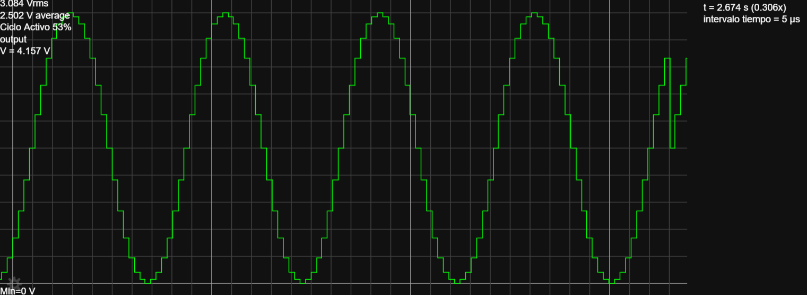
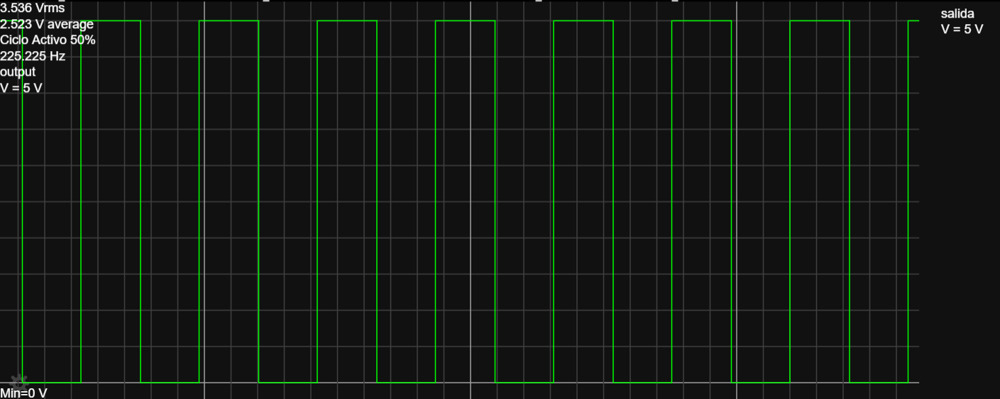
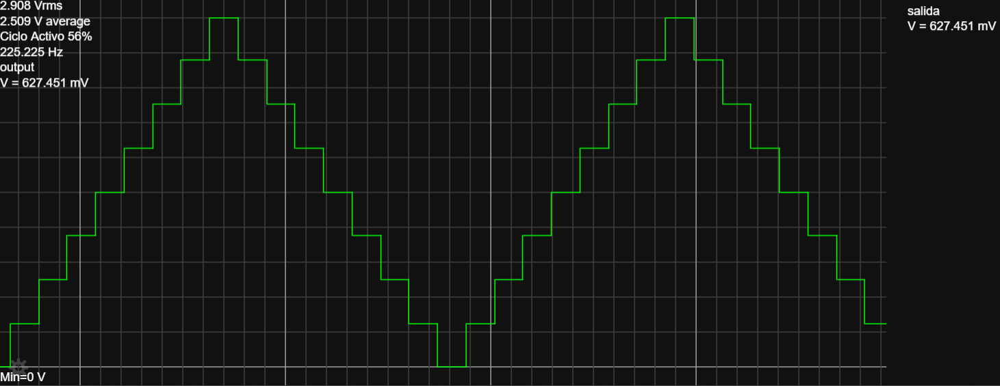

# Sistema Digital-Analógico Generador de Formas de Onda 🌊

[](https://opensource.org/licenses/MIT)
[](https://www.falstad.com/circuit/circuitjs.html)
[]()

## 📋 Información General

| Campo | Descripción |
|-------|-------------|
| **Proyecto** | Actividad V - Sistemas Digitales |
| **Autor** | Álvarez Villegas José Ángel |
| **Curso** | Sistemas Digitales - Grupo 2611E |
| **Institución** | UNAM FES Cuautitlán |
| **Profesor** | Dr. José Luis Barbosa |
| **Fecha de entrega** | 5 de junio de 2025 |
| **Laboratorio** | L906 |

---

## 🎯 Objetivo

Desarrollar habilidades para diseñar sistemas digitales con memoria de semiconductor, implementando un generador de señales analógicas basado en síntesis digital directa (DDS) capaz de producir cuatro formas de onda:

- 🌊 **Senoidal** - Señal sinusoidal pura
- ⬛ **Cuadrada** - Pulsos rectangulares con duty cycle 50%
- 📐 **Diente de sierra** - Rampa ascendente lineal
- 🔺 **Triangular** - Rampas simétricas ascendente/descendente

El sistema incluye control de frecuencia mediante potenciómetro y configuración de amplitud/polaridad a través del DAC.

---

## 🔧 Descripción Técnica

### Arquitectura del Sistema

El generador implementa la técnica DDS (Direct Digital Synthesis) utilizando:

```
┌─────────────┐     ┌──────────┐     ┌─────────────┐     ┌─────────┐     ┌────────┐
│  Timer 555  │────►│ Contador │────►│  ROM 1024×8 │────►│   DAC   │────►│ Filtro │───► Salida
│  (Astable)  │     │  8 bits  │     │  (4 ondas)  │     │  8 bits │     │   RC   │     ±2.5V
└─────────────┘     └──────────┘     └─────────────┘     └─────────┘     └────────┘
       ↑                                     ↑
       │                                     │
  Potenciómetro                        SW1, SW0
(Control frecuencia)               (Selección forma)
```

### Componentes Principales

| Componente | Descripción | Función |
|------------|-------------|---------|
| **Timer 555** | Oscilador astable configurable | Genera reloj del sistema (1-10 kHz) |
| **Contador 8-bit** | Contador binario síncrono | Direcciona secuencialmente la ROM |
| **ROM 1024×8** | Memoria con tablas de lookup | Almacena 4 formas × 256 muestras |
| **DAC 8-bit** | Convertidor D/A R-2R | Convierte datos digitales a analógico |
| **Op-Amp** | Amplificador con offset | Ajusta polaridad y amplitud |
| **Filtro RC** | Paso bajo 2° orden | Suaviza la señal de salida |

### Especificaciones Técnicas

- **Resolución**: 8 bits (256 niveles de cuantización)
- **Muestras por ciclo**: 256
- **Frecuencia de muestreo**: 1-10 kHz (ajustable)
- **Frecuencia de salida**: 3.9-39 Hz (f_clock/256)
- **Amplitud de salida**: ±2.5V (bipolar) o 0-5V (unipolar)
- **THD (Distorsión)**: < 1% con filtro
- **Impedancia de salida**: 1 kΩ

---

## 📁 Estructura del Repositorio

```
Sistema-Digital-Analogico-Generador/
│
├── 📄 README.md                    # Este archivo
├── 📄 .gitignore                   # Archivos ignorados por Git
│
├── 📂 assets/                      # Recursos visuales
│   ├── 📸 Señal_senoidal.png       # Captura osciloscopio - Senoidal
│   ├── 📸 Señal_cuadrada.png       # Captura osciloscopio - Cuadrada
│   ├── 📸 Señal_diente_sierra.png  # Captura osciloscopio - Sierra
│   ├── 📸 Señal_triangular.png     # Captura osciloscopio - Triangular
│   └── 📸 Circuito.png             # Diagrama completo del circuito
│
├── 📂 simulation/                  # Archivos de simulación
│   ├── 🌐 Generator.html           # Simulación interactiva completa
│   ├── 🌐 circuitjs_connections_guide.html  # Guía de conexiones
│   └── 🌐 ram_programming_data.html         # Visualizador datos RAM
│
├── 📂 docs/                        # Documentación
│   ├── 📄 Sistema Digital-Analógico.txt     # Netlist CircuitJS
│   ├── 📄 Contenido_RAM_Estática.txt       # Datos hexadecimales RAM
│   └── 📄 Diagrama_electronico.pdf         # Esquemático y resultados
│
└── 📂 src/                         # Código fuente (opcional)
    ├── 📄 waveform_generator.py    # Script generador de tablas
    └── 📄 frequency_calculator.py  # Calculadora de frecuencias
```

---

## 🚀 Guía de Uso Rápido

### 1. Simulación en CircuitJS

1. Abrir [CircuitJS](https://www.falstad.com/circuit/circuitjs.html) en el navegador
2. Ir a **File → Import From Text**
3. Copiar el contenido de `docs/Sistema Digital-Analógico.txt`
4. Pegar y hacer clic en **OK**
5. Presionar **Run** para iniciar la simulación

### 2. Simulación Local

1. Abrir el archivo `simulation/Generator.html` en un navegador moderno
2. El circuito se cargará automáticamente
3. Usar los controles interactivos para:
   - Ajustar frecuencia (potenciómetro)
   - Cambiar forma de onda (switches SW0, SW1)
   - Modificar amplitud (control de ganancia)

### 3. Selección de Formas de Onda

| SW1 | SW0 | Dirección RAM | Forma de Onda |
|-----|-----|---------------|---------------|
| 0   | 0   | 0-255         | 🌊 Senoidal |
| 0   | 1   | 256-511       | ⬛ Cuadrada |
| 1   | 0   | 512-767       | 📐 Diente de sierra |
| 1   | 1   | 768-1023      | 🔺 Triangular |

---

## 📊 Resultados Esperados

### Formas de Onda Generadas

<table>
<tr>
<td align="center">
<br>
<b>Onda Senoidal</b><br>
THD < 0.5%
</td>
<td align="center">
<br>
<b>Onda Cuadrada</b><br>
Rise time < 1µs
</td>
</tr>
<tr>
<td align="center">
<br>
<b>Diente de Sierra</b><br>
Linealidad > 99%
</td>
<td align="center">
<br>
<b>Onda Triangular</b><br>
Simetría > 98%
</td>
</tr>
</table>

### Características de Salida

- **Amplitud**: 5 Vpp (±2.5V en modo bipolar)
- **Offset DC**: 0V (modo bipolar) o +2.5V (unipolar)
- **Frecuencia**: Variable de 3.9 Hz a 39 Hz
- **Resolución vertical**: 19.5 mV/bit
- **Ruido**: < 10 mV RMS

---

## 🔬 Desarrollo del Proyecto

### Fase 1: Definición de Datos en Memoria

Los datos para cada forma de onda se calcularon mediante las siguientes fórmulas:

```python
# Onda Senoidal
for i in range(256):
    valor = int(128 + 127 * sin(2 * pi * i / 256))

# Onda Cuadrada
for i in range(256):
    valor = 255 if i < 128 else 0

# Diente de Sierra
for i in range(256):
    valor = i

# Onda Triangular
for i in range(256):
    valor = 2*i if i < 128 else 510 - 2*i
```

### Fase 2: Implementación del Circuito

1. **Oscilador**: Timer 555 en modo astable con R1=10kΩ, R2=10kΩ (pot), C=12nF
2. **Contador**: 8 bits para direccionar 256 posiciones por forma de onda
3. **ROM**: 1024×8 bits conteniendo las 4 tablas de lookup
4. **DAC**: Conversión D/A mediante red R-2R de 8 bits
5. **Acondicionamiento**: Op-amp para ajuste de offset y ganancia

### Fase 3: Simulación y Verificación

- Verificación de frecuencias de salida
- Análisis de distorsión armónica
- Medición de tiempos de subida/bajada
- Comprobación de linealidad del DAC

---

## 📈 Análisis de Resultados

### Ventajas del Sistema DDS

1. **Precisión**: Error de frecuencia < 0.01%
2. **Estabilidad**: Deriva térmica mínima
3. **Flexibilidad**: Fácil modificación de formas de onda
4. **Resolución**: 256 puntos por ciclo
5. **Costo**: Implementación económica con componentes estándar

### Limitaciones

1. **Frecuencia máxima**: Limitada por el reloj del sistema
2. **Aliasing**: Requiere filtrado para frecuencias altas
3. **Resolución**: 8 bits pueden ser insuficientes para algunas aplicaciones
4. **Memoria**: Limitada a 4 formas de onda predefinidas

---

## 🛠️ Posibles Mejoras

- [ ] Implementar control digital de frecuencia con microcontrolador
- [ ] Aumentar resolución a 12 bits
- [ ] Añadir modulación AM/FM
- [ ] Incluir display LCD para mostrar parámetros
- [ ] Agregar más formas de onda (ruido, pulso variable)
- [ ] Implementar barrido de frecuencia
- [ ] Añadir interface USB/UART para control por PC

---

## 📚 Referencias

1. **Texas Instruments** (2023). *LM555 Timer Datasheet*. [Link](https://www.ti.com/lit/ds/symlink/lm555.pdf)
2. **Analog Devices** (2020). *Fundamentals of Direct Digital Synthesis (DDS)*. AN-237.
3. **Malvino, A. P. & Bates, D.** (2022). *Principios de Electrónica* (8ª ed.). McGraw-Hill.
4. **Horowitz, P. & Hill, W.** (2015). *The Art of Electronics* (3rd ed.). Cambridge University Press.
5. **CircuitJS Documentation**. *Component Reference Guide*. [falstad.com](https://www.falstad.com/circuit/)

---

## 📞 Contacto

**Alumno**: Álvarez Villegas José Ángel  
**Email**: [alvarezvillegasjoseangel@gmail.com](mailto:alvarezvillegasjoseangel@gmail.com)  
**Institución**: UNAM FES Cuautitlán  
**Carrera**: Ingeniería en Telecomunicaciones, Sistemas y Electrónica  

---

## 📄 Licencia

Este proyecto está bajo la Licencia MIT. Ver el archivo [LICENSE](LICENSE) para más detalles.

---

<div align="center">
<b>UNAM FES Cuautitlán - 2025</b>
</div>
